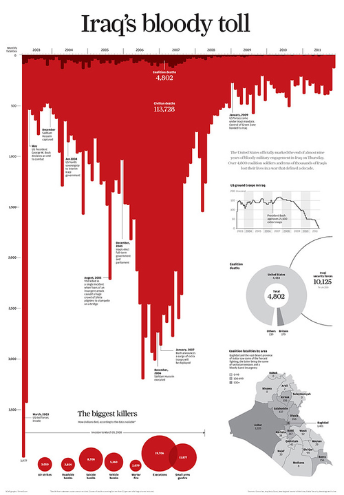

**Something** to tell the data to others.

---

### {data-transition="fade-in slide-out"}

<blockquote markdown=1 style="font-size:.7em;font-style:normal;margin-top:3em;">
 
artefact  <small style="vertical-align:middle !important">(<em>US</em> <strong>artifact</strong>)</small> <small style="vertical-align:middle !important;font-weight:bold;color:green">noun</small></blockquote>

<blockquote markdown=1 style="font-size:.7em;font-style:normal;">
<small>1</small> An object made by a human being, typically one of cultural or historical interest.  

<em>‘gold and silver artefacts’</em>
</blockquote>

<blockquote markdown=1 style="font-size:.7em;font-style:normal;">

<small>2</small> Something observed in a scientific investigation or experiment that is not naturally present but occurs as a result of the preparative or investigative procedure.

<em>‘the curvature of the surface is an artefact of the wide-angle view’</em>
</blockquote>

The Oxford Dictionary of English

::: notes

Dataviz are manufactured products, are not "found in nature" -> they carry interpretations by the creator, so it's important to be aware of this

Now let's dissect the artefact...

:::

### 1. Data visualization as an artefact The atomic level  {data-transition="slide-in fade-out"}

   

Maximum data density is `1:1`, and this is not usually the case:

<table style="margin:2em auto;font-family:'Fira Mono';background-color:#eee;">
    <tr>
        <td style="border-bottom:0 solid white;text-align:right;padding:0 1em;">data points</td>
        <td rowspan="2" style="vertical-align:middle;border-bottom:0 solid white;">  &lt; </td>
        <td rowspan="2" style="vertical-align:middle;border-bottom:0 solid white;"> pixels</td>
    </tr>
    <tr>
        <td style="text-align:right;padding:0 1em;">observations</td>
    </tr>
</table>

::: notes

**Observations** need to be transformed into visual **marks**.

Data Density: An overall characteristic of the visual elements, used in combination, is data density. Data density refers to the number of useful data points you can get into an area.

We can only represent as many marks (as representations of observations) as we have pixels: in a picture of 1000 x 1000 pixels, the maximum of observations to fit is 1 million. How big is that?

More than 1 pixel is used to represent each data point, + complimentary pixels for titles, labels, white space.

Reduction is required. 

:::

### 1. Data visualization as an artefact The atomic level  {data-transition="fade"}

 

Some strategies to overcome this constraint:

>1. Filter observations
>2. Split data into multiple charts
>3. Augmented visualizations
>4. Densify

::: notes

Not only that so much data can be displayed, but that it cannot actually be correctly interpreted.

1, 2, 3 and 5, escape densification; 4 represents density.

:::

### 1. Data visualization as an artefact The atomic level  {data-transition="fade"}

**1. Filter observations** 

>- By design, communicating a selection of data
>- By allowing users to filter according to their interests
>    + Innovative filtering  (i.e. [Smart brushing](https://youtu.be/VU117h6wT6w?t=580))
<!-- (https://youtu.be/ogfR4emjgP4?t=111) -->

::: notes

To make a selection of the data to display.

- by design, using criteria present in the data.
- by users, requires interaction / UX design.

innovation in the part of how the user interacts with the data: smart brushing 

:::

### {data-transition="fade" data-background-iframe="https://www.youtube.com/embed/VU117h6wT6w?controls=0&amp;start=580"}

::: notes

Instead of selecting by line, allows the user to select by pattern. Useful for data exploration

run up to `now they're translating the brush from left to right` <!-- `individual nodes of the brush can also be moved` -->

Interpretation is up to the specific dataset and the objectives of the viz, but the point is that while it may allow for more complex insight, it also requires complex interaction capacity on the part of the user

:::

### 1. Data visualization as an artefact The atomic level  {data-transition="fade"}

**2. Split data into multiple charts** 

Facets, trellis, small multiples.

### {data-transition="fade"}

](img/covid-us-states.png)

<!-- {height="300"} -->

::: notes

Small multiples are sets of charts of the same type, with the same scale, presented together at a small size and with minimal detail, usually in a grid of some kind (in this case grid irrelevant). The term was at least popularized by Edward Tufte, appearing first in his seminal book _Visual Display of Quantitative Information_ in 1983. He says of them:

>Small multiples are economical: once viewers understand the design of one [chart], they have immediate access to the data in all the other [charts]… as the eye moves from one [chart] to the next, the consistency of the design allows viewers to focus on changes in the data rather than on changes in graphical design.

These will show up again later. 

find another one?

:::

### 1. Data visualization as an artefact The atomic level  {data-transition="fade"}

**3. Augmented visualizations** 

. . .

, adding marginal histograms to ggplot2 (by Dean Attali)](img/ggplot-extra.png){height="350"}

::: notes

adding redundant views on the same data

:::

### 1. Data visualization as an artefact The atomic level  {data-transition="fade"}

**3. Augmented visualizations** 

### 1. Data visualization as an artefact The atomic level  {data-transition="fade"}

**4. Densify**

>- Escaping overplotting in scatterplots 

. . .

{height="325"}

::: notes

Crowded scatterplots are a classic example. What do you think we could do?

:::

### 1. Data visualization as an artefact The atomic level  {data-transition="fade"}

**4. Densify**

- Escaping overplotting in scatterplots 

{height="325"}

::: notes

We can restort to a graphic resource like the alpha channel: still not useful

:::

### 1. Data visualization as an artefact The atomic level  {data-transition="fade"}

**4. Densify**

- Escaping overplotting in scatterplots 

{height="325"}

::: notes

Actually requires/involves statistical simplification.

Color is in logaritmic scale, so density is more apparent.

:::

### 1. Data visualization as an artefact The atomic level  {data-transition="fade"}

**4. Densify**

- Timelines 

{height="300"}

::: notes

a stock market dataset of 3,500 historical New York Stock Exchange closing prices.

:::

### 1. Data visualization as an artefact The atomic level  {data-transition="fade"}

**4. Densify**

- Timelines 

{height="300"}

::: notes

Dense clusters of lines are easy to spot in blue, while bright yellow shows areas with few stock price lines. The drop that came with the financial crisis in 2008 is clearly visible. Similarly, we can see two dense bands of stock values around $15 and $25, showing that companies (or customers) tend toward round stock prices.

This is similar to what happens with marathon finishing times, what is called "Reference-Dependent Preferences" that model behaviour towards arbitrary references for no evident reasons other than the reference itself.

:::

### 1. Data visualization as an artefact The atomic level  {data-transition="fade"}

(off-topic: reference-dependent preferences)

{height="400"}

::: notes

Graph showing a large dataset of marathon finishing times (n=9,789,093)

>We provide visual and statistical evidence that round numbers (e.g., a four-hour marathon) serve as reference points in this environment and as a result produce significant bunching of performance at these round numbers. Bunching is driven by planning and adjustments in effort provision near the finish line and cannot be explained by explicit rewards (e.g., qualifying for the Boston Marathon), peer effects, or institutional features (e.g., pacesetters).

:::

### 1. Data visualization as an artefact The atomic level  {data-transition="fade"}

A couple more things at this level of the number of observations:

- the time factor
- _nothingness_
- uncertainty, projections and other non-factual data

### 1. Data visualization as an artefact The atomic level  {data-transition="fade"}

**The time factor**

- Static visualizations with real data (at the time of loading)
- Real-time visualizations, static and auto-refreshed 
- Streaming data visualizations showing the flow of data

Require an additional effort for operational intelligence, where immediate decision making could be a requirement.

Source: Aragues 2018

There is more time than real-time.

::: notes

- A static visualization that uses the data that is available when the visualization is created. Any new data requires a refresh.
- From Windows Task Manager: `Ctrl+Shift+Esc`
    - A real-time visualization that looks like the static one but updates itself constantly.
    - A streaming data visualization that shows the flow of data and the impact it has on the statistics.

Perception of moving elements poses an additional difficulty for interpretation.

<!-- Gapminder: https://youtu.be/hVimVzgtD6w?t=147

https://medium.com/@urban_institute/4-observations-on-animating-your-data-visualizations-cf987b069c35

Periphery plots: https://vimeo.com/363453522
-->

:::

### {data-transition="fade" data-background-iframe="https://www.youtube.com/embed/hVimVzgtD6w?controls=0&amp;start=149"}

::: notes

Global Development-Health to Swedish undegraduate students, top-grade instution. Did a pre-test: asked about child mortality on 5 pairs of countries (with double difference), mean 1.8/5 CI 0.4 = his course made sense. Chimpanzees 2.5. Repeated on professors, 2.4/0.4 

Hans Rosling shifted the widespread view of a world divided into us/west and them/developing countries

:::

### 1. Data visualization as an artefact The atomic level  {data-transition="fade"}

**The time factor**

A note of caution on using animations: 

>- They rely on working memory (from one frame to the next), so change should be obvious
>- Users needs to find the area of interest on their own, so they may miss the point (selective attention)

### {data-transition="fade" data-background-iframe="https://www.youtube.com/embed/vJG698U2Mvo?controls=0"}

::: notes

we are missing a lot of what goes on around us, and that we have no idea that we are missing so much.

https://forms.gle/fyWU4enxBwhMQtnC6

:::

### {data-transition="fade" data-background-iframe="https://www.youtube.com/embed/IGQmdoK_ZfY?controls=0"}

::: notes

Subjects who knew about videos like this one consistently spotted the gorilla in the new video, but they were slightly less likely to notice the other events. 

Foreknowledge that unexpected events might occur does not enhance the ability to detect other such events.

https://forms.gle/sZWuRP9Ht2AQyCH78

:::

### 1. Data visualization as an artefact The atomic level  {data-transition="fade"}

**How to communicate _nothingness_?** (Kirk 2014)

>- **Null** &nbsp; Absence of measurement
>- **Zero** &nbsp; Absence of amount/magnitude

::: notes

first question we should ask: what is missing? what can we learn from the gaps?

<!-- run up to "what can we learn fron the gaps" -->

`null` in the age of information overload, data absence is more and more significant. may help in the detection of faulty sensors. If models are built filtering nulls, this insight may be lost. -> flat electroencephalogram, absence of brainwaves is important to notice

:::

###  {data-transition="fade" data-background-iframe="https://www.youtube.com/embed/JqzAuqNPYVM?start=542&amp;controls=0&amp;stop=607"}

::: notes

run up to John Snow

:::

###  {data-transition="fade" data-background-iframe="https://www.youtube.com/embed/JqzAuqNPYVM?start=669"}

::: notes

run up to `the only option we've got in many respects`

:::

### 1. Data visualization as an artefact The atomic level  {data-transition="fade"}

**How to communicate _nothingness_?**

- **Null** &nbsp; Absence of measurement
- **Zero** &nbsp; Absence of amount/magnitude  
- **Blank** &nbsp; Try to use _nothing_ to represent _something_

::: notes

`zero` can be represented by 

- position + axis
- area + axis
- color shading
- density
- angle? we can't see 0º
- area only? we can't see

the last two require an alternative (like annotation)

`blank` gives us space to breath. Requires courage, implies losing the potential to densify, add advertising.

There is one thing we don't want to make visible: the design. Should not interfere. 

:::

###  {data-transition="fade" data-background-iframe="https://www.youtube.com/embed/JqzAuqNPYVM?start=1153"}

::: notes

glass ceiling only

:::

### 1. Data visualization as an artefact The atomic level  {data-transition="fade"}

**How to communicate _nothingness_?**

- **Null** &nbsp; Absence of measurement
- **Zero** &nbsp; Absence of amount/magnitude
- **Blank** &nbsp; Try to use _nothing_ to represent _something_

>- The design should be **invisible**

###  {data-transition="fade" data-background-iframe="https://www.youtube.com/embed/JqzAuqNPYVM?start=1363"}

::: notes

Invisible design, should not interfere with reading the graph. There is quite a lot of blank space, but very little non-data-ink. 

Run up to Antoine de Saint-Exupery

:::

### 1. Data visualization as an artefact The atomic level {data-transition="fade"}

Communicating **uncertainty, projections,**  
and other non-factual data is challenging.

. . .

### 1. Data visualization as an artefact The atomic level {data-transition="fade-in slide-out"}

Communicating **uncertainty, projections,**  
and other non-factual data is challenging.

{height="300"} 

::: notes

Better ways to do this are still being investigated.

Margins of error must also be communicated, and they are often mistakenly interpreted as the probability for an event to happen.

This was about how to reduce the number of observations to represent in a graph. Now, about the number of variables, there is some translation to be made.

- [ ] find others

:::

### 1. Data visualization as an artefact Number of variables 

 

A **mark** is a basic graphical element in an image.

{width="400"}

::: notes

Marks represent observations/groups of observations. We have a limited space to include those. 

:::

### 1. Data visualization as an artefact Number of variables 

A visual **channel** is a way to control the appearance of marks.

{width="400"}

::: notes

Channels represent information about the marks (variables), qualitites. 

Don't take up space, BUT there are only so many channels we can use in a visual representation.

One and only one attribute/variable should be used per channel. Multiple channels per attribute are possible (redundant encoding).

All channels are not equal: the selection of marks and channels should be guided by the principles of expressivenes and effectiveness. i.e. if communicating magnitude, no sense in using size to represent anything else. 

:::

### 1. Data visualization as an artefact Number of variables 

 

It is required to reduce dimensionality (statistically): PCA, factors, clustering.

::: notes

Graphic variables than can be used are limited, a reduction is required. 

Once the most important attributes/variables for the desired insight have been identified, the selection of marks and channels should ensure that they are encoded with the highest ranked.

:::
### 1. Data visualization as an artefact Number of variables 

{width="600"}

::: notes

The choice of which attributes/variables to encode with position is the most central choice in visual encoding.

The combination of these elements of visual language has generated commonly used ways, or idioms, to represent certain types of data (i.e. line graphs for time-dependent unique variables). 

However, sometimes the "classical" or pre-set ways or conventions to represent information will not be the most effective (e.g. line graphs for time progression). In that case,

:::

### 1. Data visualization as an artefact Idioms  {data-transition="slide-in fade-out"}

{width="600"}

### 1. Data visualization as an artefact Generating new idioms  {data-transition="slide-in fade-out"}

 

A word of caution:

- will need to be custom coded
- readers will require training
- correct interpretation may be more time demanding

. . . 

[Xenographics](https://www.xeno.graphics/): Weird but (sometimes) useful charts

::: notes

Many examples of this in Xenographics. 

We have seen some Xenographics charts already: denselines

- [ ] covid?

:::

### 1. Data visualization as an artefact Generating new idioms  {data-transition="fade"}

 

::: notes

Compact the area chart by slicing it horizontally, and then then shifting the slices to baseline zero. It’s like a combo area chart and heatmap.

:::

<!-- ### 1. Data visualization as an artefact Generating new idioms  {data-transition="fade"}

{height="325"
} -->

<!-- ### 1. Data visualization as an artefact Generating new idioms  {data-transition="fade"}

{height="325"} -->

### 1. Data visualization as an artefact Generating new idioms  {data-transition="fade"}

{height="425"} 

::: notes

Small multiple line charts on a scatter plot. Each line shows change in job count for an industry. Horizontally, they’re organized by average salary, and vertically, they’re organized by relative change since the end of the recession. Green represents growth and red represents decline. Hovering allows more detailed exploration of each line.

Another approach could be using small multiples: adding multiple simple charts, instead of making a complex one. Another way to use multiple charts are

:::

### 1. Data visualization as an artefact Multiple Linked Views (MLV)   {data-transition="slide-in fade-out"}

>In a MLV system, a dataset is shown in multiple simple visualizations, with the data items shown in the different charts corresponding to each other. The charts in each visualization can be used to highlight, control, or filter the data items shown in the others. 

(Meyer & Fihser 2018)

::: notes

To make an analogy with language, when idioms are not enough to communicate a complex message, combinations of idioms, that is, more complex paragraphs, are required.

:::

### {data-background-iframe="https://www.youtube.com/embed/kiXMn2VPZek" data-transition="fade"}

(Lagner, Kister & Dachselt 2019)

::: notes

Multiple views, with an innovative UI. Different levels of viewing: overview vs detail.

AND linked views; a selection in one part drives change in another

= complex interaction on the part of users. 

:::

### 1. Data visualization as an artefact Multiple Linked Views (MLV)   {data-transition="fade-in slide-out"}

Another example:

[COVID-19 Dashboard by the Center for Systems Science and Engineering (CSSE) at Johns Hopkins University (JHU)](https://coronavirus.jhu.edu/map.html)

### 1. Data visualization as an artefact Beyond 2 dimensions  {data-transition="slide-in fade-out"}

virtual / augmented reality

### {data-background-iframe="https://www.youtube.com/embed/8j9r9JKIqww" data-transition="fade"}

::: notes

Realidad virtual: Still purely graphic, tú te metes en el gráfico.

:::

### {data-background-iframe="https://www.youtube.com/embed/p4fB_OfoaZA?start=167" data-transition="fade"}

::: notes

Realidad aumentada: El gráfico se saca a la realidad y se coordina con elementos de la realidad física.

Run up to `eyes`

:::

### 1. Data visualization as an artefact Other senses  {data-transition="fade"}

 (Guillemot 2018)](img/sound.jpg){height="400"}

::: notes

Not exactly visualization.

Sound: improves accesibility. Keyboard navigation enables sound cues for each representation, and the whole chart can be _sonified_.

Already mentioned with electroencephalograms.

:::

### 1. Data visualization as an artefact Other senses  {data-transition="fade-in slide-out"}

)](img/smell-necklace.png){height="400"}

# 2. Data visualization as  a communication product {data-transition="slide-in fade-out"}

---

Something to **tell** the data to others.

---

### {data-transition="fade"}

<h2 style="margin-bottom:2em;">2.&nbsp;Data visualization as a communication product</h2>

>The modern approach to data visualization is focused on quickly making data visualization. 

(Meeks 2018)

::: notes

These artefacts, or products, we are making to be told to others, or communicated. We will now see the implications of this social action applied to data visualization through a series of articles published by Elijah Meeks: Data visualization Engineer at Apple, formerly Netflix.

Even if this section shows the most communicative-social science view, he is actually an engineer and wrote a book about D3js. He is advocating this communicative view into the more "this is an engineering problem" take. 

He sees a great problem in current data visualization.

:::

### {data-transition="fade"}

<h2>2.&nbsp;Data visualization as a communication product</h2>

Focus on speed affects:

- how data visualization products are designed
- what tools are used to create them
- the role of the creator in relation to the product
- how engagement with readers in envisioned

::: notes

>This breackneck pace is a real data visualization constraint.

The fast mode of dataviz is real and important, but when we let it become our only view into what dataviz is, we limit ourselves in planning for how to build, support and design dataviz.

Which doesn't mean being fast will not be important sometimes, BUT it can not be at the expense of the fact that [NEXT]

:::

### {data-transition="fade-in slide-out"}

<h2 style="margin-bottom:1em;">2.&nbsp;Data visualization as a communication product</h2>

>Ultimately, data visualization is not a technical problem, it's a design problem and, more than that, a communication problem.

(Meeks 2018)

. . .

Let's look at what charts **say**, **mean**, and **do**.

::: notes

Which is the main point of my presentation here today. So let's go slow down a bit

:::

### 2. Data visualization as a communication product What charts say {data-transition="slide-in fade-out"}

**Explicitly**

Charts _do_ "show me the data" (actually, it's more that they **tell** the data than actually show it).

Means choosing the right specific chart to use in order to display and query the data.

. . .

**How to improve:** Expose data cleanly and clearly. Aim for either query or validation. Distinguish accuracy _vs._ precision.

::: notes

Accuracy refers to the closeness of a measured value to a standard or known value. For example, if in lab you obtain a weight measurement of 3.2 kg for a given substance, but the actual or known weight is 10 kg, then your measurement is not accurate. In this case, your measurement is not close to the known value.

Precision refers to the closeness of two or more measurements to each other. Using the example above, if you weigh a given substance five times, and get 3.2 kg each time, then your measurement is very precise. Precision is independent of accuracy. You can be very precise but inaccurate, as described above. You can also be accurate but imprecise.

For example, if on average, your measurements for a given substance are close to the known value, but the measurements are far from each other, then you have accuracy without precision.

::: 

### 2. Data visualization as a communication product What charts say {data-transition="fade"}

**Implicitly**

No chart is an unbiased view of the data, as data visualization is a manufactured artefact.

<blockquote style="font-size:.8em">
    
    All data is transformed to be in a chart, and the inaction of not designing that transformation carries just as strong an implication as the action of transforming it.

</blockquote>

(Meeks 2018)

::: notes

there is manufacture = subjectivity from the first moment of the data coding/gathering: choice of variables, variable names, gathering means...

:::

### 2. Data visualization as a communication product What charts say {data-transition="fade"}

<table style="margin-top:-25px;">
    <tr>
        <td>
        {height="450"}
        </td>
        <td class="fragment" data-fragment-index="1">{height="450"}</td>
    </tr>
</table>

<figure class="fragment" data-fragment-index="1"><figcaption>
Original infographic (right) by Simon Scarr and redesigned, more default representation of an histogram (left), redesigned by Andy Cotgreave (Meeks 2018)</figcaption></figure>

::: notes

This chart would be an example of "not designing" or using the usual ways of doing dataviz. However this is actually a remake of this original chart:

Carries a very strong message. Red, bars point down, looks like blood. Very evocative, emphasized by the title.

There is deliberate choice in:

- Rotation: There's still a peak, but the decline is more apparent
- Title: To match the main takeaway of the graph
- Color: not like blood anymore
- "Situation in Iraq is improving" --> Completely different message!

Neither of those charts is lying. The opinionated nature of charts should be acknowledged and embraced. 

:::

### 2. Data visualization as a communication product What charts say {data-transition="fade"}

**Implicitly**

The implicit channel of a data visualization (the title and other framing elements) can be even more powerful than the explicit channel.

. . .

**How to improve:** Style should be intentional, purposeful and thematically appropriate, not the result of defaults or superficial decisions.

::: notes

As these usually appeal to emotion instead of reason. 

:::

### 2. Data visualization as a communication product What charts say {data-transition="fade"}

**About the underlying system** 

 

>[...] all charts display data and all data is a proxy for the systems that created and measured that data.

(Meeks 2018)

::: notes

There's sort of a cruel irony to the way we simultaneously share these data products so enthusisastically while bemoaning the privacy issues that are necessary for their creation.

:::

### 2. Data visualization as a communication product What charts say {data-transition="fade"}

**About the underlying system** 

{width=700}

::: notes

Do you ever remember telling Facebook what football team you root for?

:::

### 2. Data visualization as a communication product What charts say {data-transition="fade"}

**About the underlying system** 

 

>[...] all charts display data and all data is a proxy for the systems that created and measured that data.

(Meeks 2018)
**How to improve:** Caution not to reveal an underlying system that is proprietary or confidential.

### 2. Data visualization as a communication product What charts say {data-transition="fade"}

**Descriptively**

>- internally: axes, labels, annotations
>- externally: surrounding text, figure descriptions, discussions

. . .

Unlike the implicit channel, the descriptive channel is active and purposeful (not subconscious).

. . .

**How to improve:** Consider annotations, labels, axis elements as part of the data visualization.

::: notes
 
In the way they are described.

_vs._ implicit channel: NOT "read this as a swear of blood, dripping down your screen" 
:::

### 2. Data visualization as a communication product What charts say {data-transition="fade"}

](img/covid-crop-tweet.png)

### 2. Data visualization as a communication product What charts say {data-transition="fade"}

](img/covid-crop-tweet2.png)

### 2. Data visualization as a communication product What charts say {data-transition="fade"}

### 2. Data visualization as a communication product What charts say {data-transition="fade-in slide-out"}

>By being more explicit in our own understanding of what charts say and how we can systematically describe what they say, we can grow more capable of using the channels available in that expression to our advantage.

(Meeks 2018)

. . .

What does your chart say that you didn't intend?

### 2. Data visualization as a communication product What charts mean {data-transition="slide-in fade-out"}

**Intentionally**

 

>The mode and purpose of a chart should be well understood by the chart maker and immediately apparent to the chart reader.

(Meeks 2018)

::: notes

When they get perceived by the receivers, they generate meaning. 

Charts mean more than just what they say.

:::

### 2. Data visualization as a communication product What charts mean {data-transition="fade"}

**Historically**

 

Charts are products of their time. 

It is important to provide background about the data sources, to enable checking whether they are still based on relevant priorities, dimensions and metrics.

### 2. Data visualization as a communication product What charts mean {data-transition="fade"}

**Historically**

### 2. Data visualization as a communication product What charts mean {data-transition="fade"}

**Culturally**

 

Charts should be adapted to the culture they will be consumed in.

::: notes

In broad terms (as _western culture_) but also in the most local sense (as _company intra-culture_).

:::

### 2. Data visualization as a communication product What charts mean {data-transition="fade"}

**Contextually**

A chart might end up serving as context: design and provide a version of the chart that is suitable for inclusion alongside other charts.

Enable removing and adjusting data visualization elements to reduce complexity, not based on screen size as in responsive data visualization, but on priority.

::: notes

A chart that’s being integrated into another display or presentation can find itself in front of an audience that does not have the same domain knowledge as the primary audience, so this is yet another reason to have its data sources, dimensions and metrics more explicitly described.

:::

### 2. Data visualization as a communication product What charts mean {data-transition="fade-in slide-out"}

 

>Meaning-making may sound too soft to the kind of technical professionals that make and read data visualization but communication without meaning is just noise.

(Meeks 2018)

### 2. Data visualization as a communication product What charts do {data-transition="slide-in fade-out"}

 

The most important thing about a chart is its impact. 

::: notes

Impact is the effect that should be caused by the chart.

Like does it drive decision-making or not. Different kinds of impact:

:::

### 2. Data visualization as a communication product What charts do {data-transition="fade"}

**Provide insights**

Identify and emphasize the insights that the readers might expect.

. . .

{height="200"}

::: notes

In this example those consist of the maxima/minima of the data (whether as an extent or as individual features), volume of the total data represented, points of interest, volatility of change or overall trend in the direction of change.

:::

### 2. Data visualization as a communication product What charts do {data-transition="fade"}

**Cause change**

 

As difficult to measure as it is important.

How have they impacted business decisions? How were they used in presentations? Where they modified (changed colours, cropped, annotated) somehow?

::: notes

Understanding how a particular chart was an effective piece of evidence or motivation is key to developing more effective data visualization.

- [ ] add murdoch crop

:::

### 2. Data visualization as a communication product What charts do {data-transition="fade"}

**Cause visual literacy**

 

>All data visualization was, at some point, complex data visualization, until an audience grew comfortable and literate enough to read it.

(Meeks 2018)

::: notes

Languages are live things, that evolve over time, and require breakthrough.

>[...] the new form cannot be introduced until it is understood but can only be understood once it's introduced.

:::

### 2. Data visualization as a communication product What charts do {data-transition="fade"}

**Cause visual literacy**

{height="325"}

### {data-transition="fade"}

](img/covid-connected-scatterplot.gif)

### 2. Data visualization as a communication product What charts do {data-transition="fade"}

**Create new charts**

{height="350"}

::: notes

Catalogs of data visualization have the tendency to treat every form as a category of one without drawing connections between them, which disguises how charts lead to other charts.

chart lineage

:::

### 2. Data visualization as a communication product What charts do {data-transition="fade-in slide-out"}

 

>All communication is evaluated based on content, but persuasive communication, which is all data visualization unless it is purely decorative, is rightly also evaluated based on effect.

(Meeks 2018)

::: notes

persuasive in the sense of driving decision or actions on users.

Ultimately, what charts do may be the one most important thing.

:::

# 3. The artefact goes social

---

Something to tell the data to **others**.

::: notes

To put a product to use, transmit a message, prevent making noise, it is required to adapt to your audience. 

Couple ways to adapt that something we tell to those others: data counseling, responsive data visualization.

:::

---

### 3. The artefact goes social Data counseling {data-transition="slide-in fade-out"}

 

>[...] brings domain expertise into the operationalization process to help inform decisions about good proxies as well as to uncover insights using the resulting visualizations.

(Meyer & Fisher 2018)

::: notes

proxies = the best indicator to answer to the questions that you have.

:::

### 3. The artefact goes social Data counseling {data-transition="fade"}

Based on **interviews** (1) for

>- gaining an understanding of the questions and data
>- get feedback on proxies, explorations, and visualization **prototypes** (2)

::: notes

- gaining... FIRST/BEFORE
- get feedback on... AFTER

:::

### 3. The artefact goes social Data counseling {data-transition="fade"}

**Interviews**

>The role of the interviewer is to ask questions that will guide the stakeholders toward elucidating the information necessary for working through an operationalization process and designing visualizations.

(Meyer & Fisher 2018)

### 3. The artefact goes social Data counseling {data-transition="fade"}

**Interviews**

Identify stakeholders:

>- analysts
>- data producers
>- gatekeepers
>- decision makers
>- connectors

### 3. The artefact goes social Data counseling {data-transition="fade"}

**Interviews**

Require practice and experience.

Semistructured: be prepared, but also be open.

>- start with open ended questions (problem, data, context)
>- use the conversation to search out the more abstract question

::: notes

Are kind of an art. 

- unstructured: can uncover unknown needs and goals, but it can take a significant amount of time to get to anything useful.
- structured: while efficient, leave little room for discovering new insights.

:::

### 3. The artefact goes social Data counseling {data-transition="fade"}

**Interviews**

Use traditional conversation / interpersonal communication skills to prevent dead ends: keep them talking

>- rephrase responses back 
>- ask the same or similar questions in different ways
>- explore a completely different conversational topic

::: notes

Some techniques to achieve this:

:::

### 3. The artefact goes social Data counseling {data-transition="fade"}

**Interviews**

Contextual interviews

>- take place in the stakeholder's work environment
>- consist of demonstrations of the tools and data inspection methods currently in use

::: notes

often starts by asking the stakeholder to either walk through a specific analysis task they have already performed or conduct someof their work for that day with the interviewer present. The stakeholder talks through each step they are taking.

:::

### 3. The artefact goes social Data counseling {data-transition="fade"}

**Rapid prototyping**

 

>[...] is a process of trying out many visualization ideas as quickly as possible and getting feedback from stakeholders on their efficacy.

(Meyer & Fisher 2018)

### 3. The artefact goes social Data counseling {data-transition="fade"}

**Rapid prototyping**

 

&ne; _fast_ data visualization

. . .

&ap; agile/lean methodologies  
and user-centered design

::: notes

NOT to be confused with **fast** dataviz, which is more related to using the defaults or leaving un-designed elements. 

:::

### 3. The artefact goes social Data counseling {data-transition="fade"}

**Rapid prototyping**

 

::: notes

low-fi: 

1. sketched on paper or on a whiteboard, 
2. digital mockups that may include some controls for explaining interaction ideas (slides = digital mockups)
3. can incorporate charts generated in Excel or Tableau with fake or sampled data (= existing chart tools). 

- Great for communicating the gist of an idea in an interview, fast and easy to produce. 
- Rapidly establish whether the visualizationd designer is on the same page as the stakeholders.

hi-fi: 

- custom visualizations which must be created from scratch. Largely contain the core functionality. 
- Risk being confused with final 
- Meant to be thrown away, the point is not to worry about the code other than to confirm that ideas can work.

:::

### 3. The artefact goes social Data counseling {data-transition="fade"}

**Rapid prototyping**

Prototypes are made to obtain feedback on them: get to the stakeholders early and often.

Focus not on whether they like it or not, but rather on **what the visualization can and cannot do** (contextual interview where the stakeholder uses the visualization).

### 3. The artefact goes social Responsive data visualization {data-transition="fade"}

 

>Responsive web design, and responsive data visualization are not simply a way to make our content accessible on smaller screens. We need to build an ergonomic web that feels natural regardless of device type.

(Hinderman 2018)

::: notes

= implies more than simply using fluid measuers

::: 

### 3. The artefact goes social Responsive data visualization {data-transition="fade"}

 

Unknowns require adaptability.

>- the context in which **the user** is trying to consume the visualization
>- changes in **the data** that is being displayed

::: notes

>[...] every single thing that you can do to make your visualization more clear, more usable, or more communicative is a reaction to either the context in which the user is trying to consume it, or a change in the data being displayed.

- the user: core of responsive web design as a whole
- the data: unique to data visualization. This is what makes a visualization FULLY responsive _vs._ simply scaling them at different viewport sizes, like an image.

:::

### 3. The artefact goes social Responsive data visualization {data-transition="fade"}

**Output side (the client)**

Making things work in all screen types by redrawing charts to fit its container. 

Match CSS breakpoints + add any new ones as the content requires: group data to fit (trade-off precision for reduced rendering complexity and performance).

::: notes

With a combination of CSS and D3.

Breakpoints: build for your smallest supported screen: then, as you find a spot at which it makes sense to redraw, create a new breakpoint there.

:::

### 3. The artefact goes social Responsive data visualization {data-transition="fade"}

**Input side (the data)**

Adapting at breakpoints. No need to just redraw the exact same elements:

>As long as the message being conveyed by the data is the same, and the point you're trying to prove is always present, you should prove it with as much firepower as you have available.

(Hinderman 2018, p.361)

::: notes

We need to KNOW 

- what is the message being conveyed by the data (what does it SAY)
- what is the point you're trying to prove (what does it MEAN)

:::

### 3. The artefact goes social Responsive data visualization {data-transition="fade"}

**Input side (the data)**

Adapting at interaction points. 

>[...] present a rational default but enable users to dig into more complex or specific layers of data when the device's capabilities limit the presentation of both at the same time.

(Hinderman 2018, p.362)

::: notes

The most crucial and digestive information should be prioritised, but interaction should enable more granularity.

:::

### 3. The artefact goes social Responsive data visualization {data-transition="fade"}

Different views on heartrate depending on device:

 

{width="200"} 

### 3. The artefact goes social Responsive data visualization {data-transition="fade"}

Different views on heartreate depending on device:

{height="350"}

### 3. The artefact goes social Responsive data visualization {data-transition="fade"}

Different views on heartreate depending on device:

 

### 3. The artefact goes social Responsive data visualization {data-transition="fade"}

{height="350"}

::: notes

In adapting to different devices, perception of different kinds of charts may differ. 

:::

### {data-background-iframe="https://www.youtube.com/embed/MwJmjTBfOx0" data-transition="fade-in slide-out"}

::: notes

a vast majority of smartwatch interactions last under 5 s. Some chart types are not apropriate for certain devices.

:::

<!--
### 3. The artefact goes social Responsive data visualization {data-transition="fade"}

The other "side" of adaptation is on the side of the user.

Data served

### Responsive data visualization

Device dependant

### Responsive data visualization

Alerts

Example: sports tracker on watch vs. phone vs. computer -->

# Epilogue

### 

{style="margin-top:2em;"}

::: notes

Data visualization is a communication product. 

There is no such thing as raw data, and there is neither such a thing as a raw data visualization (aseptic, unbiased view on the data). Even if we understood datavis as a photograph of the data, photos are long taken as political products, with a meaning, and one view of reality and not another one. But what's more, I wouldn't even say that datavis are photos of the data, they are more illustrations, drawings of the data, more crafted than photographs. And as such, we should draw them with purpose, and we should draw them FOR the user/the reader, meaning we should make them adapted, and responsive.

:::

---

<h1>Thank you!</h1>

This presentation is available at  
[`https://mrn.bz/EDI2019`](https://mrn.bz/EDI2019)

{width="50" style="vertical-align:middle;"}
[&#64; DeustoKomunika](http://twitter.com/deustokomunika)  {width="50" style="vertical-align:middle;padding-left:25px;"}
[&#64; DeustoData](http://twitter.com/deustodata) [&#64; miren@mastodon.eus ](http://mastodon.eus/@miren){style="padding-left:25px;"}  [&#64; neregauzak](https://twitter.com/neregauzak){style="padding-left:25px;"}

### Resources

- [D3.js](https://d3js.org/)    
    A JavaScript library for manipulating documents based on data. D3 helps you bring data to life using HTML, SVG, and CSS.
- [ggplot2](https://ggplot2.tidyverse.org/)  
    Data visualization package for the statistical programming language R. 
- [IEEEVIS 2020](http://ieeevis.org/year/2020/info/papers-sessions)  
    Conference on Scientific visualization, Information visualization and Visual Analytics. Papers from the 2019 edition.
- [matplotlib](https://matplotlib.org/), [seaborn](https://seaborn.pydata.org/)  
    Just two of the many data visualization libraries available for Python
- [Open Access Vis](http://oavis.steveharoz.com/)  
   A collection of open access visualization research at the VIS 2018 conference.
- [Xenographics](http://xeno.graphics)  
   Weird but (sometimes) useful charts.
- [Data visualization Catalogue](https://datavizcatalogue.com/index.html)  
   A library of different information visualization types.

### References

Eric J. Allen, Patricia M. Dechow, Devin G. Pope, George Wu (2017) "[Reference-Dependent Preferences: Evidence from Marathon Runners](https://faculty.chicagobooth.edu/devin.pope/research/pdf/Website_Marathons.pdf)". _Management Science_ 63(6):1657-1672. https://doi.org/10.1287/mnsc.2015.2417

Anthony Aragues (2018), _Visualizing Streaming Data_. O'Reilly Media

Jeremy Ashkenas & Alicia Parlapiano (2014), ["How the Recession Reshaped the Economy, in 255 Charts](https://www.nytimes.com/interactive/2014/06/05/upshot/how-the-recession-reshaped-the-economy-in-255-charts.html?mtrref=undefined&gwh=0B9210D70DC7FAE7E8AF89C32004F1F3&gwt=pay&assetType=REGIWALL)" in _TheUpshot_ at The New York Times

Tanja Blascheck, Lonni Besançon, Anastasia Bezerianos, Bongshin Lee, Petra Isenberg (2019). "[Glanceable Visualization: Studies of Data Comparison Performance on Smartwatches](https://www.microsoft.com/en-us/research/publication/glanceable-visualization-studies-of-data-comparison-performance-on-smartwatches/)". _IEEE Transactions on Visualization and Computer Graphics_ 25(1) [`10.1109/TVCG.2018.2865142`](https://ieeexplore.ieee.org/document/8443125)`

Matthew Brehmer, Bongshin Lee, Petra Isenberg, Eun Kyoung Choe (2019). "[Visualizing Ranges over Time on Mobile Phones: A Task-Based Crowdsourced Evaluation](https://www.microsoft.com/en-us/research/publication/visualizing-ranges-over-time-on-mobile-phones-a-task-based-crowdsourced-evaluation/)". _IEEE Transactions on Visualization and Computer Graphics_ 25(1) [`10.1109/TVCG.2018.2865234`](https://ieeexplore.ieee.org/document/8440812)

Brendan Gregg (2016), "[The Flame Graph](https://queue.acm.org/detail.cfm?id=2927301)". _ACM Queue_ 14(2)

Luc Guillemot (2018), "[How Does This Data Sound?](https://blog.interactivethings.com/how-does-this-data-sound-945ed27a1a95)"

Jeffrey Heer, Nicholas Kong, Maneesh Agrawala (2009), "[Sizing the Horizon: The Effects of Chart Size and Layering on the Graphical Perception of Time Series Visualizations](http://vis.berkeley.edu/papers/horizon/)". _ACM Human Factors in Computing Systems (CHI)_, pp. 1303 - 1312 [`10.1145/1518701.1518897`](https://dl.acm.org/citation.cfm?doid=1518701.1518897)

Bill Hinderman (2015), _Building Responsive Data Visualization for the Web_. O'Reilly

Christophe Hurter, Nathalie Henry Riche, Steven M. Drucker, Maxime Cordeil, Richard Alligier, Romain Vuillemot (2018), "[FiberClay: Sculpting Three Dimensional Trajectories to Reveal Structural Insights](http://recherche.enac.fr/~hurter/FiberClay.html)", _IEEE Transactions on Visualization and Computer Graphics_ 25(1)

Alex Kale, Francis Nguyen, Matthew Kay, Jessica Hullman (2019), "[Hypothetical Outcome Plots Help Untrained Observers Judge Trends in Ambiguous Data](https://idl.cs.washington.edu/papers/hops-trends/)", _IEEE Transactions on Visualization and Computer Graphics_ 25(1) 

Andy Kirk (2014), "[The Design of Nothing: Null, Zero, Blank](https://www.youtube.com/watch?v=JqzAuqNPYVM)", _OpenVis Conference 2014_

Ihor Kovalyshyn (2017), ["When Scatter Plot Doesn't Work"](https://delta1epsilon.github.io/2017/When-Scatter-Plot-doesn%27t-work/)

Ricardo Langner, Ulrike Kister, Raimund Dachselt (2019). "[Multiple Coordinated Views at Large Displays for Multiple Users: Empirical Findings on User Behavior, Movements, and Distances](https://imld.de/en/research/research-projects/mcv-displaywall/)", _IEEE Transactions on Visualization and Computer Graphics_ 25(1)  (proc. InfoVis 2018) [`10.1109/TVCG.2018.2865235`](https://doi.org/10.1109/TVCG.2018.2865235)

Elijah Meeks (2017), ["Strategic Innovation in Data Visualization Will Not Come From Tech"](https://medium.com/visualizing-the-field/strategic-innovation-in-data-visualization-will-not-come-from-tech-4c1f7379ae39)

&mdash; (2018), "[Data Visualization, Fast and Slow](https://medium.com/@Elijah_Meeks/data-visualization-fast-and-slow-d2653d4850b0)"

Dan Meth (2009), "[The Trilogy Meter](https://danmeth.myportfolio.com/post/77471620/my-trilogy-meter-1-in-a-series-of-pop-cultural)" 

Miriah Meyer & Danyel Fisher (2018), _Making Data Visual_. O'Reilly Media

Dominik Moritz and Danyel Fisher (2018), "Visualizing a Million Time Serieswith the Density Line Chart" [arXiv:1808.06019v2](https://arxiv.org/pdf/1808.06019.pdf) [cs.HC]

Tamara Munzner (2015). _Visualization Analysis and Design_. CRC Press

Jonas Schöley (2018), "[Choropleth maps with tricolore](https://cran.r-project.org/web/packages/tricolore/vignettes/choropleth_maps_with_tricolore.html)"

Daniel J. Simons (2010), "[Monkeying around with the gorillas in our midst: familiaritywith an inattentional-blindness task does not improve thedetection of unexpected events](https://journals.sagepub.com/doi/abs/10.1068/i0386)", _i-Perception_, vol.1, pp. 3–6 [`10.1068/i0386`](http://dx.doi.org/10.1068/i0386)

Ronell Sicat, Jiabao Li. [_DXR: A Toolkit for Building Immersive Data Visualizations_](https://sites.google.com/view/dxr-vis/download?authuser=0)

--- 

<h1>License</h1>

{height="50px" style="display:inline-block;margin-right:2em;"}
{height="50px" style="display:inline-block;"}
{height="50px" style="display:inline-block;"}

Copyright &copy; 2019 University of Deusto 
This work (except for the quoted images, whose rights are reserved to their owners) is licensed under the Creative Commons “Attribution-ShareAlike” License. To view a copy of this license, visit [http://creativecommons.org/licenses/by-sa/3.0/](http://creativecommons.org/licenses/by-sa/3.0/)
