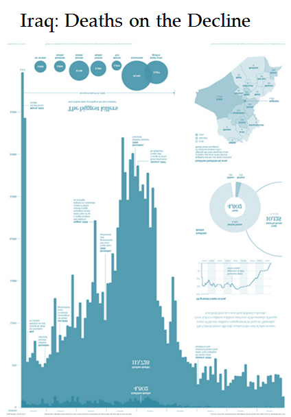
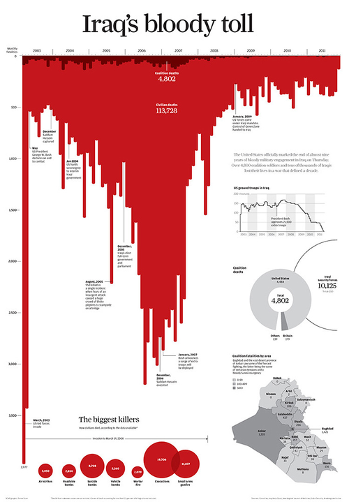

---
title: Data visualization
pagetitle: Data visualization
subtitle: From micro to macro, with context
author: Mikel Madina & Miren Berasategi
theme: deusto
deusto: TRUE
slide-level: 3
...

## 1. Data visualization as artefact  {data-transition="slide-in fade-out"}

### {data-transition="fade-in slide-out"}

<h2>1. Data visualization as artefact</h2>

<blockquote markdown=1 style="font-size:.7em;font-style:normal;">
 
artefact  <small style="vertical-align:middle !important">(<em>US</em> <strong>artifact</strong>)</small> <small style="vertical-align:middle !important;font-weight:bold;color:green">noun</small></blockquote>

. . . 

<blockquote markdown=1 style="font-size:.7em;font-style:normal;">
<small>1</small> An object made by a human being, typically one of cultural or historical interest.  

<em>‘gold and silver artefacts’</em>
</blockquote>

. . .

<blockquote markdown=1 style="font-size:.7em;font-style:normal;">

<small>2</small> Something observed in a scientific investigation or experiment that is not naturally present but occurs as a result of the preparative or investigative procedure.

<em>‘the curvature of the surface is an artefact of the wide-angle view’</em>
</blockquote>

. . . 

The Oxford Dictionary of English

### 1. Data visualization as artefact The atomic level  {data-transition="slide-in fade-out"}

Number of observations &rarr; marks

. . .

<!-- Data Density
An overall characteristic of the visual elements, used in combination, is data density. Data density refers to the number of useful data points you can get into an area 

. . . --> 

<table style="margin:2em auto;font-family:'Fira Mono';background-color:#eee;">
    <tr>
        <td style="border-bottom:0 solid white;text-align:right;padding:0 1em;">data points</td>
        <td rowspan="2" style="vertical-align:middle;border-bottom:0 solid white;">  &lt; </td>
        <td rowspan="2" style="vertical-align:middle;border-bottom:0 solid white;"> pixels</td>
    </tr>
    <tr>
        <td style="text-align:right;padding:0 1em;">observations</td>
    </tr>
</table>

. . .

In a picture of 1000 x 1000 pixels, the maximum of observations to fit is 10<small>6</small> (1 million). How big is that?

### 1. Data visualization as artefact The atomic level  {data-transition="fade"}

Some strategies to overcome these constraints:

>1. Filter
>2. Facets/small multiples
>3. Augmenting visualizations
>4. Densify

### 1. Data visualization as artefact The atomic level  {data-transition="fade"}

**1. Filter observations** 

>- By design, communicating a selection of data
>- By allowing the user to filter according to their interests
>    + Innovative filtering  (i.e. [Smart brushing](https://youtu.be/VU117h6wT6w?t=576))

### {data-transition="fade" data-background-iframe="https://www.youtube.com/embed/VU117h6wT6w?controls=0&amp;start=576"}

### 1. Data visualization as artefact The atomic level  {data-transition="fade"}

**2. Facets/small multiples** 

Hemen zerbait? erreferentziaren bat?

https://plot.ly/ggplot2/facet/

### 1. Data visualization as artefact The atomic level  {data-transition="fade"}

**3. Augmenting visualizations** 

. . .

, adding marginal histograms to ggplot2 (by Dean Attali)](ggplot-extra.png){height="350"}

### 1. Data visualization as artefact The atomic level  {data-transition="fade"}

**4. Densify**

>- Escaping overplotting in scatterplots 

. . .

{height="325"}

### 1. Data visualization as artefact The atomic level  {data-transition="fade"}

**4. Densify**

- Escaping overplotting in scatterplots 

{height="325"}

### 1. Data visualization as artefact The atomic level  {data-transition="fade"}

**4. Densify**

- Escaping overplotting in scatterplots 

{height="325"}

### 1. Data visualization as artefact The atomic level  {data-transition="fade"}

**4. Densify**

- Timelines 

step-by-step

{height="325"}

### 1. Data visualization as artefact The atomic level  {data-transition="fade"}

About real time... ?¿

Streaming vs real time data

### 1. Data visualization as artefact The atomic level  {data-transition="fade"}

How to communicate _nothingness_? (Kirk 2014)

###  {data-transition="fade" data-background-iframe="https://www.youtube.com/embed/JqzAuqNPYVM?start=524"}

### 1. Data visualization as artefact The atomic level  {data-transition="fade"}

How to communicate _nothingness_?

>- **Null** &nbsp; Absence of measurement
>- **Zero** &nbsp; Absence of amount/magnitude
>- **Blank** &nbsp; Try to use _nothing_ to represent _something_

::: notes

`null` in the age of information overload, data absence is more and more significant
`zero` can be represented by 

- position + axis
- area + axis
- color shading
- density
- angle? we can't see 0º
- area only? we can't see

the last two require an alternative (like annotation)

`blank` gives us space to breath. requires courage, implies losing the potential to densify, add advertising

:::

###  {data-transition="fade" data-background-iframe="https://www.youtube.com/embed/JqzAuqNPYVM?start=1153"}

### 1. Data visualization as artefact The atomic level  {data-transition="fade"}

How to communicate _nothingness_?

- **Null** &nbsp; Absence of measurement
- **Zero** &nbsp; Absence of amount/magnitude
- **Blank** &nbsp; Try to use _nothing_ to represent _something_

>- The design should be **invisible**

###  {data-transition="fade" data-background-iframe="https://www.youtube.com/embed/JqzAuqNPYVM?start=1363"}

### 1. Data visualization as artefact The atomic level {data-transition="fade-in slide-out"}

Projections, statistical models, uncertainty

Unpublished papers:

Alex Kale, Francis Nguyen, Matthew Kay, Jessica Hullman (2019), "[Hypothetical Outcome Plots Help Untrained Observers Judge Trends in Ambiguous Data](https://idl.cs.washington.edu/papers/hops-trends/)", _IEEE Trans. Visualization & Comp. Graphics (Proc. InfoVis)_, 2019

### 1. Data visualization as artefact Number of variables 

- Reduce dimensionality (statistically): PCA, factors, clusters
- Restructure dataset (from wide to tall) (heatmaps)

### 1. Data visualization as artefact Generating a new language  {data-transition="slide-in fade-out"}

A word of caution:

- will need to be custom coded
- readers will require training
- correct interpretation may be more time demanding

. . . 

[Xenographics](https://www.xeno.graphics/): Weird but (sometimes) useful charts

### 1. Data visualization as artefact Generating a new language  {data-transition="fade"}

  
Source: Jeffrey Heer, Nicholas Kong, Maneesh Agrawala (2009), "[Sizing the Horizon: The Effects of Chart Size and Layering on the Graphical Perception of Time Series Visualizations](http://vis.berkeley.edu/papers/horizon/)". _ACM Human Factors in Computing Systems (CHI)_, pp. 1303 - 1312

### 1. Data visualization as artefact Generating a new language  {data-transition="fade"}

{height="325"
}
 
Source: Jonas Schöley (2018), "[Choropleth maps with tricolore](https://cran.r-project.org/web/packages/tricolore/vignettes/choropleth_maps_with_tricolore.html)"

### 1. Data visualization as artefact Generating a new language  {data-transition="fade"}

{height="325"
}
 
Source: Brendan Gregg (2016), "[The Flame Graph](https://queue.acm.org/detail.cfm?id=2927301)". _ACM Queue_ Vol. 14, No. 2

### {data-background-image="flamegraph.svg" data-transition="fade-in slide-out"}

### 1. Data visualization as artefact Multiple Linked Views (MLV)   {data-transition="slide-in fade-out"}

_Making Data Visual_

Ricardo Langner, Ulrike Kister, Raimund Dachselt (2019). "[Multiple Coordinated Views at Large Displays for Multiple Users: Empirical Findings on User Behavior, Movements, and Distances](https://imld.de/en/research/research-projects/mcv-displaywall/)", _IEEE Transactions on Visualization and Computer Graphics_ 25(1) (InfoVis 2018, Berlin) [`10.1109/TVCG.2018.2865235`](https://doi.org/10.1109/TVCG.2018.2865235)

### {data-background-iframe="https://www.youtube.com/embed/kiXMn2VPZek" data-transition="fade-in slide-out"}

### 1. Data visualization as artefact Beyond 2 dimensions  {data-transition="slide-in fade-out"}

### {data-background-iframe="https://www.youtube.com/embed/8j9r9JKIqww" data-transition="fade"}

<!--
    Realidad virtual:
    Still purely graphic, tú te metes en el gráfico.
-->

### {data-background-iframe="https://www.youtube.com/embed/p4fB_OfoaZA" data-transition="fade"}

<!-- Realidad aumentada:
    El gráfico se saca a la realidad y se coordina con elementos de la realidad física.
-->

### 1. Data visualization as artefact Beyond 2 dimensions  {data-transition="fade-in slide-out"}

- Virtual Reality
- Augmented reality

References:

Ronell Sicat, Jiabao Li. [_DXR: A Toolkit for Building Immersive Data Visualizations_](https://sites.google.com/view/dxr-vis/download?authuser=0)

Christophe Hurter, Nathalie Henry Riche, Steven M. Drucker, Maxime Cordeil, Richard Alligier, Romain Vuillemot (2018), "[FiberClay: Sculpting Three Dimensional Trajectories to Reveal Structural Insights](http://recherche.enac.fr/~hurter/FiberClay.html)", IEEE Transactions on Visualization and Computer Graphics_ 25(1) (InfoVis 2018, Berlin)

### 1. Data visualization as artefact Senses and control interfaces 

(How is this _visualization_?)

- Wheeled micro robots
- Sound
- _smell necklace_ https://twitter.com/NElmqvist/status/1055370456528773120

## 2. Data visualization as a tool for communication {data-transition="slide-in fade-out"}

### {data-transition="fade"}

<h2 style="margin-bottom:2em;">2.&nbsp;Data visualization as a tool for communication</h2>

>The modern approach to data visualization is focused on quickly making data visualization. 

(Meeks 2018)

### {data-transition="fade"}

<h2>2.&nbsp;Data visualization as a tool for communication</h2>

Focus on speed affects:

- how data visualization products are designed
- what tools are used to create them
- the role of the creator in relation to the product
- how engagement with readers in envisioned

::: notes

>This breackneck pace is a real data visualization constraint.

The fast mode of dataviz is real and important, but when we let it become our only view into what dataviz is, we limit ourselves in planning for how to build, support and design dataviz.

:::

### {data-transition="fade-in slide-out"}

<h2 style="margin-bottom:1em;">2.&nbsp;Data visualization as a tool for communication</h2>

>Ultimately, data visualization is not a technical problem, it's a design problem and, more than that, a communication problem.

(Meeks 2018)

. . .

Let's look at what charts **say**, **mean**, and **do**.

::: notes

Let's go slow down a bit

:::

### 2. Data visualization as a tool for communication What charts say {data-transition="slide-in fade-out"}

**Explicitly**

Charts _do_ "show me the data" (but remember that it's more that they **tell** the data than actually show it).

Means chosing the right specific chart to use in order to display and query the data.

. . .

**How to improve:** Expose data cleanly and clearly. Accuracy _vs._ precision.

::: notes

Accuracy refers to the closeness of a measured value to a standard or known value. For example, if in lab you obtain a weight measurement of 3.2 kg for a given substance, but the actual or known weight is 10 kg, then your measurement is not accurate. In this case, your measurement is not close to the known value.

Precision refers to the closeness of two or more measurements to each other. Using the example above, if you weigh a given substance five times, and get 3.2 kg each time, then your measurement is very precise. Precision is independent of accuracy. You can be very precise but inaccurate, as described above. You can also be accurate but imprecise.

For example, if on average, your measurements for a given substance are close to the known value, but the measurements are far from each other, then you have accuracy without precision.

::: 

### 2. Data visualization as a tool for communication What charts say {data-transition="fade"}

**Implicitly**

No chart is an unbiased view of the data, as data visualization is a manufactured artefact.

<blockquote style="font-size:.8em">
    
    All data is transformed to be in a chart, and the inaction of not designing that transformation carries just as strong an implication as the action of transforming it.

</blockquote>

(Meeks 2018)

### 2. Data visualization as a tool for communication What charts say {data-transition="fade"}

<table style="margin-top:-25px;">
    <tr>
        <td>
        {height="450"}
        </td>
        <td class="fragment">{height="450"}</td>
    </tr>
</table>

<figure class="fragment"><figcaption>
Original infographic (right) by Simon Scarr and redesigned, more default representation of an histogram (left), redesigned by Andy Cotgreave (Meeks 2018)</figcaption></figure>

::: notes

Very strong message. Red, bars point down, looks like blood. Very evocative, emphasized by the title.

Rotation: There's still a peak, but the decline is more aparent

Title: To match the main takeaway of the graph

Color: not like blood anymore

"Situation in Iraq is improving" --> Completely different message!

Neither of those charts is lying. The opinionated nature of charts should be acknowledged and embraced. 

:::

### 2. Data visualization as a tool for communication What charts say {data-transition="fade"}

**Implicitly**

The implicit channel of a data visualization (the title and other framing elements) can be even more powerful than the explicit channel.

. . .

**How to improve:** Style should be intentional, purposeful and thematically appropriate, not the result of defaults or superficial decisions.

### 2. Data visualization as a tool for communication What charts say {data-transition="fade"}

**Systematically** 

 

>[...] all charts display data and all data is a proxy for the systems that created and measured that data.

(Meeks 2018)

. . .

**How to improve:** Caution not to reveal an underlying system that is proprietary or confidential.

::: notes

There's sort of a cruel irony to the way we simultaneously share these data products so enthusisastically while bemoaning the privacy issues that are necessary for their creation.

:::

### 2. Data visualization as a tool for communication What charts say {data-transition="fade"}

**Descriptively**

>- internally: axes, labels, annotations
>- externally: surrounding text, figure descriptions, discussions

. . .

Unlike the implicit channel, the descriptive channel is active and purposeful (not subconscious).

. . .

**How to improve:** Consider annotations, labels, axis elements as part of the data visualization.

### 2. Data visualization as a tool for communication What charts say {data-transition="fade-in slide-out"}

 

>By being more explicit in our own understanding of what charts say and how we can systematically describe what they say, we can grow more capable of using the channels available in that expression to our advantage.

(Meeks 2018)

. . .

What does your chart say that you didn't intend?

### 2. Data visualization as a tool for communication What charts mean {data-transition="slide-in fade-out"}

### 2. Data visualization as a tool for communication What charts mean {data-transition="fade"}

**Intentional meaning**

### 2. Data visualization as a tool for communication What charts mean {data-transition="fade"}

**Historical meaning**

### 2. Data visualization as a tool for communication What charts mean {data-transition="fade"}

**Cultural meaning**

### 2. Data visualization as a tool for communication What charts mean {data-transition="fade-in slide-out"}

**Contextual meaning**

### 2. Data visualization as a tool for communication What charts do {data-transition="slide-in fade-out"}

### 2. Data visualization as a tool for communication What charts do {data-transition="fade"}

**Provide insight**

### 2. Data visualization as a tool for communication What charts do {data-transition="fade"}

**Cause change**

### 2. Data visualization as a tool for communication What charts do {data-transition="fade"}

**Cause visual literacy**

### 2. Data visualization as a tool for communication What charts do {data-transition="fade"}

**Create new charts**

## 3. The artifact goes social

### Data counseling

### Responsive data visualization

Data served

### Responsive data visualization

Device dependant

### Responsive data visualization

Alerts

### References

Source: Ihor Kovalyshyn (2017), [_When Scatter Plot Doesn't Work_](https://delta1epsilon.github.io/2017/When-Scatter-Plot-doesn%27t-work/)

Source: Dominik Moritz and Danyel Fisher (2018), "Visualizing   a Million Time Serieswith the Density Line Chart" [ arXiv:1808.06019v2](https://arxiv.org/pdf/1808.06019.pdf) [cs.HC]

Andy Kirk 2014 Null zero blank