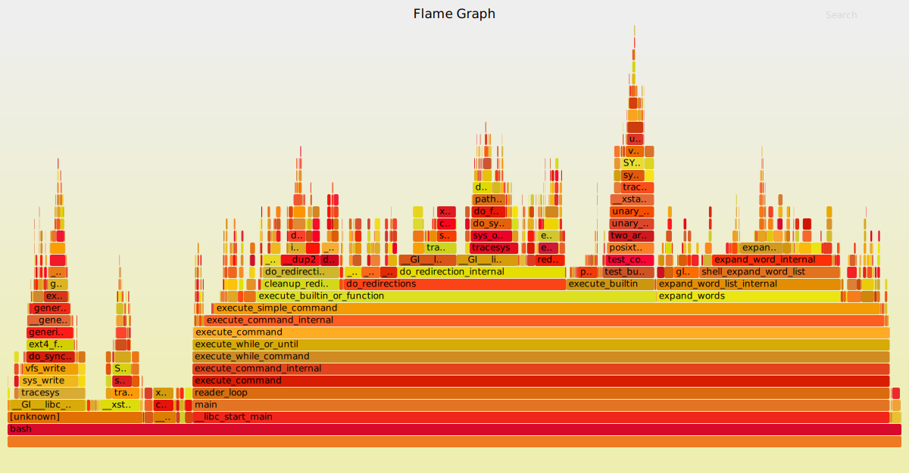

---
title: Data visualization
pagetitle: Data visualization
subtitle: From micro to macro, with context
author: Mikel Madina & Miren Berasategi
theme: deusto
deusto: TRUE
slide-level: 3
...

## 1. Data visualization as artefact  {data-transition="slide-in fade-out"}

### {data-transition="fade-in slide-out"}

<h2>1. Data visualization as artefact</h2>

<blockquote markdown=1 style="font-size:.7em;font-style:normal;">
 
artefact  <small style="vertical-align:middle !important">(<em>US</em> <strong>artifact</strong>)</small> <small style="vertical-align:middle !important;font-weight:bold;color:green">noun</small></blockquote>

. . . 

<blockquote markdown=1 style="font-size:.7em;font-style:normal;">
<small>1</small> An object made by a human being, typically one of cultural or historical interest.  

<em>‘gold and silver artefacts’</em>
</blockquote>

. . .

<blockquote markdown=1 style="font-size:.7em;font-style:normal;">

<small>2</small> Something observed in a scientific investigation or experiment that is not naturally present but occurs as a result of the preparative or investigative procedure.

<em>‘the curvature of the surface is an artefact of the wide-angle view’</em>
</blockquote>

. . . 

The Oxford Dictionary of English

### Graphic constraints  {data-transition="slide-in fade-out"}

> 1. Number of observations / marks

. . .

<table style="margin:2em auto;font-family:'Fira Mono';background-color:#eee;">
    <tr>
        <td style="border-bottom:0 solid white;text-align:right;padding:0 1em;">data points</td>
        <td rowspan="2" style="vertical-align:middle;border-bottom:0 solid white;">  &lt; </td>
        <td rowspan="2" style="vertical-align:middle;border-bottom:0 solid white;"> pixels</td>
    </tr>
    <tr>
        <td style="text-align:right;padding:0 1em;">observations</td>
    </tr>
</table>

. . .

In a picture of 1000 x 1000 pixels, the maximum of observations to fit is 10<small>6</small> (1 million). How big is that?

### Graphic constraints  {data-transition="slide-in fade-out"}

1. Number of observations / marks

. . .

Some strategies to overcome these constraints:

>1. Filter
>2. Facets/small multiples
>3. Augmenting visualizations
>4. Densify

### {data-transition="fade"}

**1. Filter observations**

>- By design 
>- By allowing the user to filter according to their interests 
>    + Innovative filtering  (i.e. [Smart brushing](https://youtu.be/VU117h6wT6w?t=576))

### {data-transition="fade" data-background-iframe="https://www.youtube.com/embed/VU117h6wT6w?controls=0&amp;start=576"}

### {data-transition="fade"}

**2. Facets/small multiples** 

Hemen zerbait? erreferentziaren bat?

### {data-transition="fade"}

**3. Augmenting visualizations** 

. . .

, adding marginal histograms to ggplot2 (by Dean Attali)](ggplot-extra.png)

### {data-transition="fade"}

**4. Densify**

>- Escaping overplotting in scatterplots 

. . .

{height="325"}

Source: Ihor Kovalyshyn (2017), [_When Scatter Plot Doesn't Work_](https://delta1epsilon.github.io/2017/When-Scatter-Plot-doesn%27t-work/)

### {data-transition="fade"}

**4. Densify**

- Escaping overplotting in scatterplots 

{height="325"}

Source: Ihor Kovalyshyn (2017), [_When Scatter Plot Doesn't Work_](https://delta1epsilon.github.io/2017/When-Scatter-Plot-doesn%27t-work/)

### {data-transition="fade"}

**4. Densify**

- Escaping overplotting in scatterplots 

{height="325"}

Source: Ihor Kovalyshyn (2017), [_When Scatter Plot Doesn't Work_](https://delta1epsilon.github.io/2017/When-Scatter-Plot-doesn%27t-work/)

### {data-transition="fade"}

**4. Densify**

- Timelines 

{height="325"}

Source: Dominik Moritz and Danyel Fisher (2018), "Visualizing   a Million Time Serieswith the Density Line Chart" [ arXiv:1808.06019v2](https://arxiv.org/pdf/1808.06019.pdf) [cs.HC]

### Graphic constraints  {data-transition="fade"}

1. Number of observations / marks

About real time... ?¿

### Graphic constraints  {data-transition="fade"}

1. Number of observations / marks

Non-existing data

... elaborate

###  {data-transition="fade" data-background-iframe="https://www.youtube.com/embed/JqzAuqNPYVM"}

### Graphic constraints  {data-transition="fade-in slide-out"}

1. Number of observations / marks

Projections, statistical models, uncertainty

Unpublished papers:

Alex Kale, Francis Nguyen, Matthew Kay, Jessica Hullman (2019), "[Hypothetical Outcome Plots Help Untrained Observers Judge Trends in Ambiguous Data](https://idl.cs.washington.edu/papers/hops-trends/)", _IEEE Trans. Visualization & Comp. Graphics (Proc. InfoVis)_, 2019

Jessica Hullman, Xiaoli Qiao, Michael Correll, Alex Kale, Matthew Kay (2019), "[In Pursuit of Error: A Survey of Uncertainty Visualization Evaluation](https://idl.cs.washington.edu/papers/uncertainty-eval-survey)", _IEEE Trans. Visualization & Comp. Graphics (Proc. InfoVis)_

### Graphic constraints

2. Number of variables

- Reduce dimensionality (statistically)
- Restructure dataset (from wide to tall): PCA, factors, clusters

### Graphic constraints  {data-transition="slide-in fade-out"}

3. Generating a new graphical language 

A word of caution:

- will need to be custom coded
- readers will require training
- correct interpretation may be more time demanding

### Graphic constraints  {data-transition="fade"}

3. Generating a new graphical language 

  
Source: Jeffrey Heer, Nicholas Kong, Maneesh Agrawala (2009), "[Sizing the Horizon: The Effects of Chart Size and Layering on the Graphical Perception of Time Series Visualizations](http://vis.berkeley.edu/papers/horizon/)". _ACM Human Factors in Computing Systems (CHI)_, pp. 1303 - 1312

### Graphic constraints  {data-transition="fade"}

3. Generating a new graphical language 

{height="325"
}
 
Source: Jonas Schöley (2018), "[Choropleth maps with tricolore](https://cran.r-project.org/web/packages/tricolore/vignettes/choropleth_maps_with_tricolore.html)"

### Graphic constraints  {data-transition="fade"}

3. Generating a new graphical language 

{height="325"
}
 
Source: Brendan Gregg (2016), "[The Flame Graph](https://queue.acm.org/detail.cfm?id=2927301)". _ACM Queue_ Vol. 14, No. 2

### {data-background-image="flamegraph.svg" data-transition="fade-in slide-out"}

### Multiple Linked Views (MLV)   {data-transition="slide-in fade-out"}

_Making Data Visual_

Graph thumbnails?

Ricardo Langner, Ulrike Kister, Raimund Dachselt (2019). "[Multiple Coordinated Views at Large Displays for Multiple Users: Empirical Findings on User Behavior, Movements, and Distances](https://imld.de/en/research/research-projects/mcv-displaywall/)", _IEEE Transactions on Visualization and Computer Graphics_ 25(1) (InfoVis 2018, Berlin) [`10.1109/TVCG.2018.2865235`](https://doi.org/10.1109/TVCG.2018.2865235)

### {data-background-iframe="https://www.youtube.com/embed/kiXMn2VPZek" data-transition="fade-in slide-out"}

### Virtual Reality  {data-transition="slide-in fade-out"}

### {data-background-iframe="https://www.youtube.com/embed/p4fB_OfoaZA" data-transition="fade"}

### {data-background-iframe="https://www.youtube.com/embed/8j9r9JKIqww" data-transition="fade"}

### Virtual Reality  {data-transition="fade-in slide-out"}

References:

Ronell Sicat, Jiabao Li. [_DXR: A Toolkit for Building Immersive Data Visualizations_](https://sites.google.com/view/dxr-vis/download?authuser=0)

Christophe Hurter, Nathalie Henry Riche, Steven M. Drucker, Maxime Cordeil, Richard Alligier, Romain Vuillemot (2018), "[FiberClay: Sculpting Three Dimensional Trajectories to Reveal Structural Insights](http://recherche.enac.fr/~hurter/FiberClay.html)", IEEE Transactions on Visualization and Computer Graphics_ 25(1) (InfoVis 2018, Berlin)

### Senses and control interfaces 

(How is this _visualization_?)

- Wheeled micro robots
- Sound
- _smell necklace_ https://twitter.com/NElmqvist/status/1055370456528773120

## 2. Data visualization as a tool for communication

### What charts say {data-transition="fade"}

### What charts say {data-transition="fade"}

Explicitly

### What charts say {data-transition="fade"}

Implicitly

### What charts say {data-transition="fade"}

Systematically

### What charts say {data-transition="fade-in slide out"}

Descriptively

### What charts mean

### What charts do

## 3. The artifact goes social

### Data counseling

### Responsive data visualization

Data served

### Responsive data visualization

Device dependant

### Responsive data visualization

Alerts
